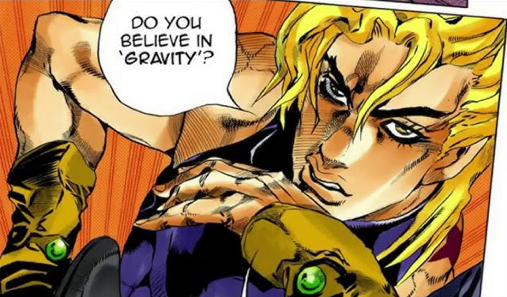
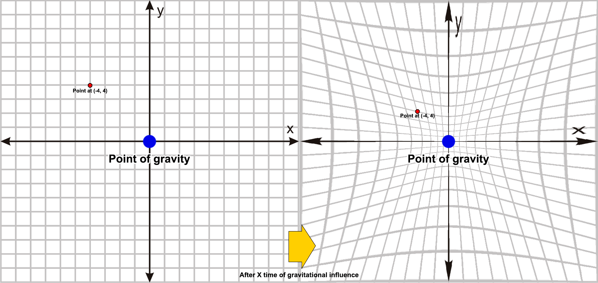
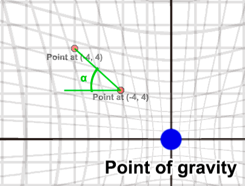
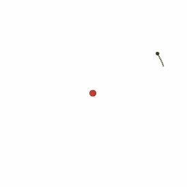
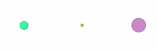

# PlaneGravitation

The aim of this project was to create a simplistic, 2D gravitation simulation with a twist: Instead of directly applying newtonian gravitational forces, the goal was to create a somewhat more realistic system with an actual space-time deformation.

**Warning:** The code is a bit CPU intensive, it should be GPU-optimised and probably the overall loop could also be made faster. Equations, scales and constants were chosen by feeling alone as I am not versed in physics 😛

# Designing the approach

To make the idea work there were some problems that built on one another, and thus needed to be tackled sequentially. These were:

- How to achieve gravitational drift
  - How to make the combination of drift and movement translate into orbits
    - How to make multiple bodies affect each other gravitationally

Next we'll go into how each one of these issues was approached.

## Achieving gravitational drift

This first question was maybe the hardest to grasp, as it wasn't straightforward to me how to translate the gravitational bend of space into a 2D plane. After scrambling my brains for some time I came up with the basis for this simulation, which I thought about as "plane compression".

The idea is that the actual coordinate space is the same at all times (i.e. a stationary object in coordinates (5, 5) would always remain in those coordinates, even when falling into another object and seemingly moving), but the coordinate plane itself is "deformed" by the gravitational force.

To better picture it, imagine a sheet of paper where two points have a gravitational attraction. The objects themselves do not actually move, rather the paper itself wrinkles instead to make them closer, and so a gravitational field compresses the coordinate space around it bringing it towards itself.

As execution time passes, the compression accelerates, thus achieving the effect of objects accelerating and falling into gravitational pits. With this approach we then have our "base" plane with the real coordinate positions of objects, and our "visual" or deformed plane, which is the one we actually draw on screen and where we see objects interacting gravitationally. This way, stationary objects do not actually move, but gravity makes the space between them collapse until they collide.

In code, we perform this by translating an object's real coordinate to its deformed position before drawing it.

## Creating orbits

Now we have a way to create gravitational drift, but giving speed to an object in this environment is not enought to have it move around in the way we may expect, that is, orbiting a source of gravity in some form.

At this stage we are still missing the rotation of the object itself. The deformation of the space where it lies not only apparently shifts its position, it also naturally shifts its direction. It's easy to think of a rocket whose trajectory is bent by the gravity of another body, at the end the rocket still follows its path head-on even if its direction has shifted (or so I think!).

Thus we should take into account the rotation produced by the apparent change in an object's position: If coordinate (-5, 5) of our base plane appears now to be in position (-3, 3) due to the deformation, we need to consider a line between these two points, and the angle between it and the X axis. We´ll use this angle to update the object's velocity on both axes (VX and VY) and generate the rotation.

Now we can actually see proper orbits!

## Having multiple gravity sources at the same time

Up until now, we have points of gravity that can influence surrounding bodies. It is when we intend to make the system a bit more complete and actually have multiple bodies influence one another, that we run into another hard question.

If we have N sources of gravity acting on the same coordinate, we then generate N possible deformations of the coordinate that we need to normalize into a single one. One might think this is as easy as averaging it all and calling it a day, but of course there are some problems.

When a source of gravity begins compressing the plane and bringing a certain point towards itself, eventually there comes a time when that specific point is brought up to the same place as the gravity source, finally collapsing all the space between them. From that moment on, they're as close as it gets and it makes no sense to bring the coordinate closer, so the calculated deformation stops changing.

This causes a situation: Imagine a setup with two gravity sources attracting a third body from equal distances, but one has a bigger mass than the other. The influenced body should slowly start falling towards the heavier source, but with this setup something different happens; it instead starts doing just that before stopping dead at an intermediate place and not really completing its fall.

What happens is, at different times, both gravity sources end up reporting a deformation equal to swallowing the point, and by just averaging it out we end up in the middle, with no further changes. We need to take into account not just the deformed coordinate, but with how much "force" it is acting. Basically, to factor in the full deformation that would happen beyond the position of the gravity source, without capping it there.

I chose <b>1.0001^totalDeformation</b> as the equation to calculate a ratio (or weight), to be applied to the deformed coordinate reported by a gravity source when normalizing it against others. I chose it because it would always grow but does so very slowly, seeking to guarantee that small differences in mass or distance still had an impact.

With this, we can now perform a weighted average on the N deformed coordinates we receive, and we get a closer approach when trying out these specific cases, albeit still an imperfect one, because drift acceleration is not correctly maintained. But we can use this to make N bodies take into account the gravitational influence of each other.